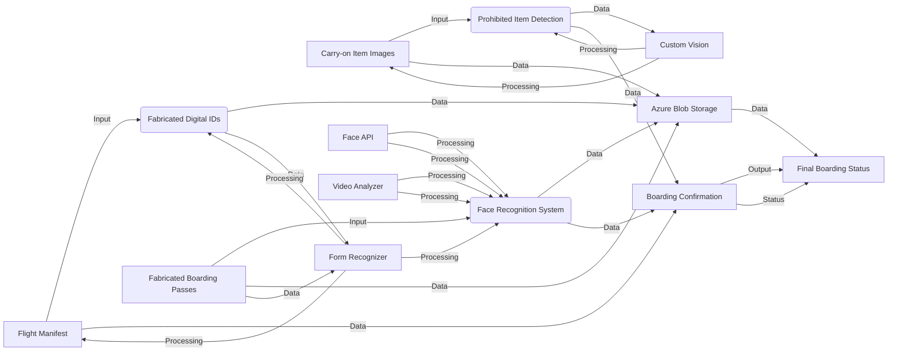

# Architecture Diagram

Explaining Architecture as shown in the above image:

1. The input layer includes the flight manifest, fabricated digital IDs, boarding passes, face recognition system, and carry-on item images.
2. All of the input data is stored in the Azure Blob Storage in the storage layer.
3. The processing layer includes the Azure services used in the project: Form Recognizer, Face API, Video Analyzer, and Custom Vision.
4. The Form Recognizer service is used to extract passenger information from the boarding passes.
5. The Face API is used for facial recognition to verify the identity of passengers using their personal IDs and the video.
6. The Video Analyzer is used to compare the face photo from the digital ID to the passenger's video to perform facial recognition.
7. The Custom Vision service is utilized to create a machine learning model for identifying prohibited items in carry-on luggage using the provided lighter images.
8. The output of the system includes the boarding confirmation and final boarding status, which are generated based on the validation results.
9. The data flows between the input, processing, and storage layers, with arrows indicating the direction of data transfer.
10. The diagram clearly illustrates the various components of the project and how they interact to simulate the automated airline boarding process.

# Objective

The objective of the architecture diagram is to provide a visual representation of the project's components and their interaction, enabling the reader to understand how input data is processed and output generated. The goal is to facilitate a comprehensive understanding of the project's architecture.