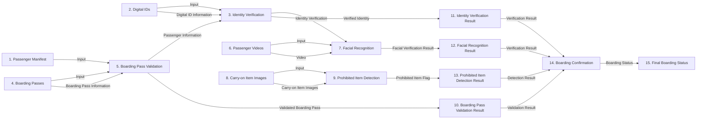

# Dataflow diagrams

Explaining Data Flow as shown in the above image:

1. The passenger manifest, digital IDs, boarding passes, passenger videos, and carry-on item images are input into the process.
2. The Azure Form Recognizer service extracts passenger information from the boarding passes.
3. The Azure Form Recognition Digital ID service extracts personal information and face from passengers' digital IDs.
4. The extracted passenger information is validated against the manifest list.
5. The passenger identity is verified using their personal ID.
6. The Azure Video Indexer service compares the face photo from the digital ID to the passenger's video to perform facial recognition.
7. Azure Custom Vision services are utilized to create a machine learning model for identifying prohibited items in carry-on luggage using the provided lighter images.
8. The Azure Custom Vision model is tested using the sample images of passenger carry-on luggage provided in the project.
9. The validation results, including the validated boarding pass, verified identity, facial recognition result, and prohibited item flag are output from the process.
10. The final boarding confirmation is displayed based on the validation results.
11. The final boarding status is output from the process.