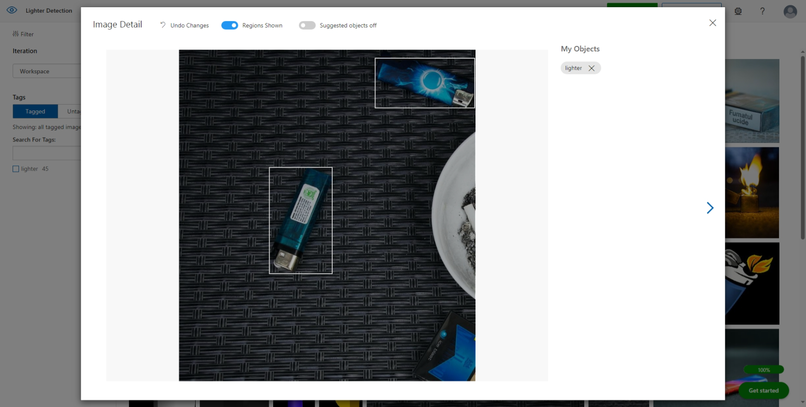
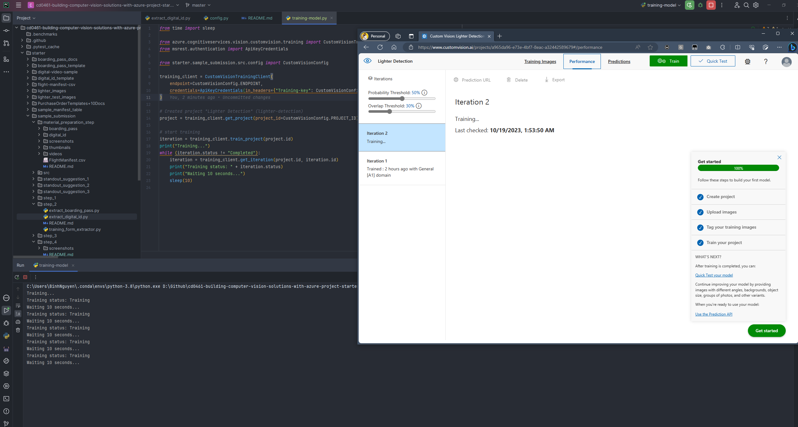

# Submission Checklist:

- [x] Screenshots from the [https://customvision.ai](https://customvision.ai) website while performing image labeling in
  the object detection model training process
    - 
- [x] [Optional] Perform the training also from the Python API and share the Python code snippet (either in text format
  or screenshot) showing model training screenshot with training images with labels
    - 
    - Source code: [[training-model.py](training-model.py)]
- [x] Screenshots from the [https://customvision.ai](https://customvision.ai) website while performing the training
  process of the object detection model
    - 
- [x] Screenshots from the [https://customvision.ai](https://customvision.ai) website while performing the validation
  process in the object detection model training process
    - 
- [x] Screenshot showing the precision and recall values of the custom object detection model
    - 
- [x] Python code snippet (either in text format or screenshot) showing model is deployed to an endpoint, and the
  endpoint URL is shared
    - 
    - Code: [pubic-api-endpoint.py](pubic-api-endpoint.py)
- [x] Python code snippet (either in text format or screenshot) showing how your custom model is used for prediction
  using your own endpoint URL
    - 
    - Code: [make-prediction.py](make-prediction.py)
- [x] Screenshots displaying lighter detection probability using the custom object detection model for every one of the
  5 provided test images
    - Code: [make-prediction-all-images.py](make-prediction-all-images.py)
    - 
    - 
    - 
    - 
    - 